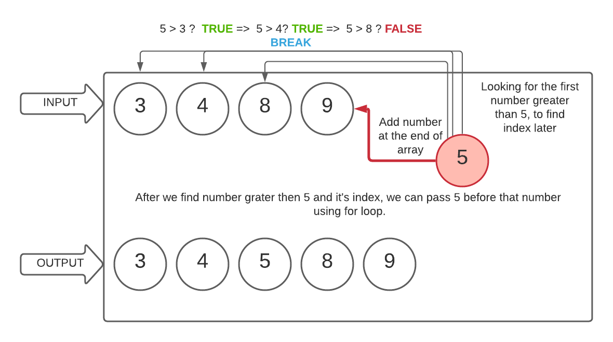

# Challenge Summary

## ARRAY SHIFT 

Insert a new element into the array at the middle index

## Challenge Description

Write a function called insertShiftArray which takes in an array and the value to be added. Without utilizing any of the built-in methods, returns an array with the new value added at the middle index.

## Approach & Efficiency

I really wanted to use built-in methods because we used to practice it during 301. But I was not allowed to do it, and I tried to solve it with using For Loops. First I added given value to the array. Second I identified the first number that is greater than given value. Then I identified index of this number to shift given value to right position.

## Solution
<!-- Embedded whiteboard image -->
