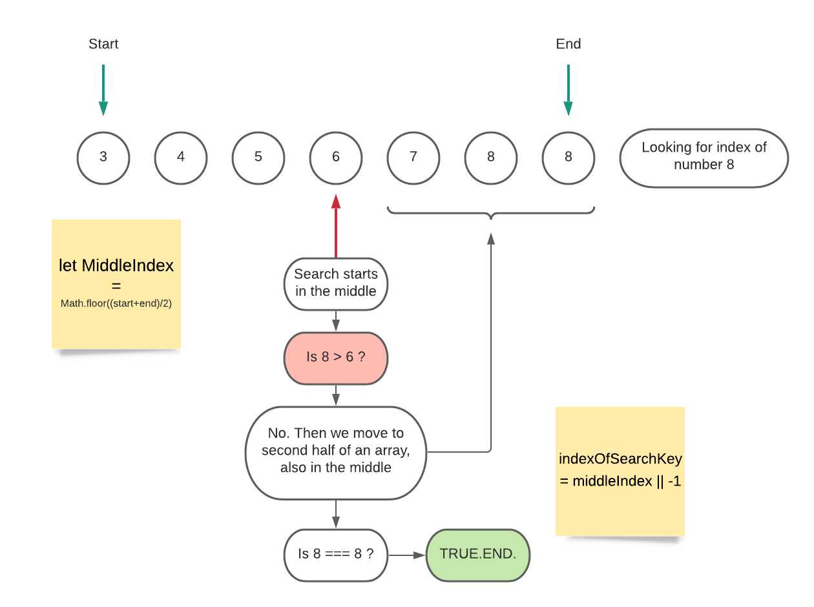

# Challenge Summary

## ARRAY SHIFT 

Find index of given number, if it exists in an array, usimg binary search method. If number doesn't exists return -1;

## Challenge Description

Write a function called BinarySearch which takes in 2 parameters: a sorted array and the search key. Without utilizing any of the built-in methods return the index of the array’s element that is equal to the search key, or -1 if the element does not exist.

## Approach & Efficiency

First I coded it with for loop, to compare later with binary search method. I've never used it before, so I had to research and to read about how it works. I understood the main difference, when we use binary search method, our function iterates fewer times than when we use for loops.

## Solution
<!-- Embedded whiteboard image -->
